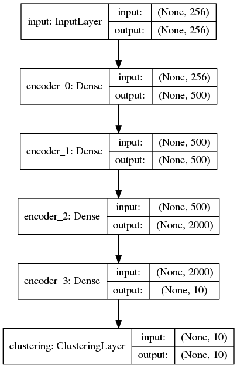

# Improved Deep Embedded Clustering (IDEC)

Keras implementation for our IJCAI-17 paper:

* Xifeng Guo, Long Gao, Xinwang Liu, Jianping Yin. 
[Improved Deep Embedded Clustering with Local Structure Preservation](https://xifengguo.github.io/papers/IJCAI17-IDEC.pdf). IJCAI 2017.

and re-implementation (not exactly for pre-training part) for paper:

* Junyuan Xie, Ross Girshick, and Ali Farhadi. Unsupervised deep embedding for clustering analysis. ICML 2016.

This code is used for quick start with DEC and IDEC algorithms. The results are not same with that reported in our paper. Use [IDEC code](https://github.com/XifengGuo/IDEC) to exactly re-implement the experiments.
   

## Differences with IDEC implementation used in paper
* The initialization step in this code trains the autoencoder in an end-to-end manner, while in paper it trains denoising stacked autoencoders.
* Recommend update_interval=20 for reutersidf10k in IDEC
* Optimizer=SGD(lr=0.01, momentum=0.99) for usps or reutersidf10k, while in paper Optimizer=SGD(lr=0.1, momentum=0.99)
* Results are worse than that reported in paper. For exact reimplementation, use [IDEC code](https://github.com/XifengGuo/IDEC).

    Table 1. Results of methods implemented by this code and [IDEC code](https://github.com/XifengGuo/IDEC), measured by Accuracy (%)
    
    Methods     |     MNIST   |   USPS   |   REUTERSIDF10K
    :-----------|:-----------:|:--------:|:--------------:
    AE+KMeans   |  79.5       |  62.3    |  48.1
    DEC         |  84.5       |  71.0    |  50.3
    IDEC        |  87.5       |  72.7    |  51.7
    AE+KMeans(paper)| 81.8    |  69.3    |  70.5
    DEC(paper)  |  86.6       |  74.1    |  73.7
    IDEC(paper) |  88.1       |  76.1    |  75.6

## Usage
1. Install [Keras v2.0](https://github.com/fchollet/keras), scikit-learn and git   
`sudo pip install keras scikit-learn`   
`sudo apt-get install git`
2. Clone the code to local.   
`git clone https://github.com/XifengGuo/IDEC-toy.git`
3. Prepare datasets.    
`cd IDEC-toy`   
`bash ./data/usps/download_usps.sh`   
`bash ./data/reuters/get_data.sh`
    
4. Run experiment on MNIST.   
`python IDEC.py mnist` or `python DEC.py mnist`   
The pretrained autoencoder weights are saved to "ae_weights.h5" and the IDEC (or DEC) model is saved to "results/idec/IDEC_model_final.h5" (or "results/dec/DEC_model_final.h5").
Then we can run IDEC algorithm or DEC with the trained autoencoder weights:   
`python IDEC.py mnist --ae_weights ae_weights.h5`   
or   
`python DEC.py mnist --ae_weights ae_weights.h5`

5. Run experiment on USPS.   
`python IDEC.py usps --update_interval 30`   
`python DEC.py usps --update_interval 30`

6. Run experiment on REUTERSIDF10K.   
`python IDEC.py usps --n_clusters 4 --update_interval 20`   
`python DEC.py usps --n_clusters 4 --update_interval 20`

## Models
The DEC model:    

The IDEC model:    
